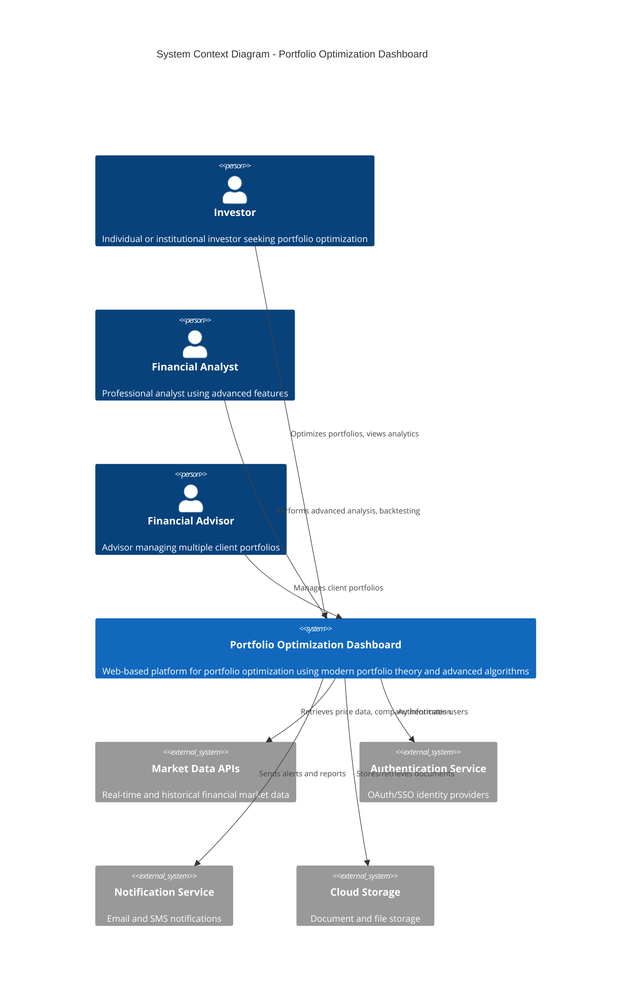
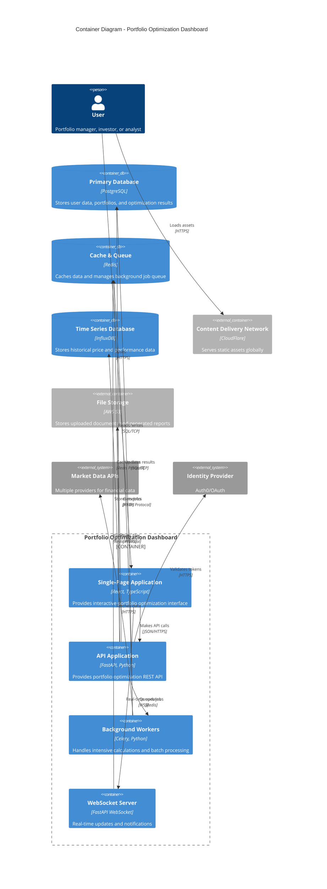
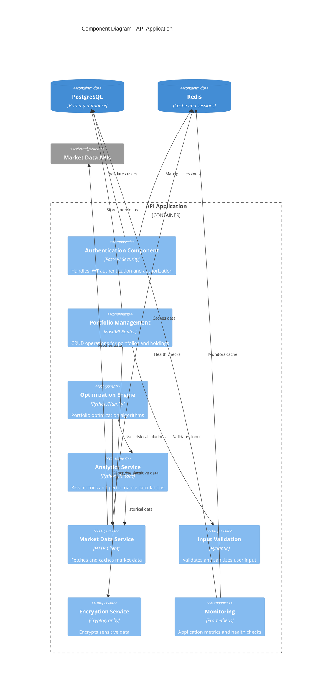
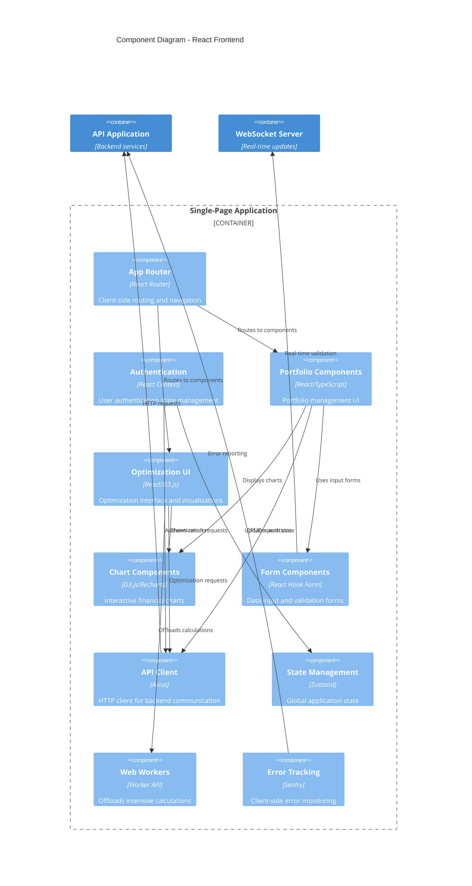
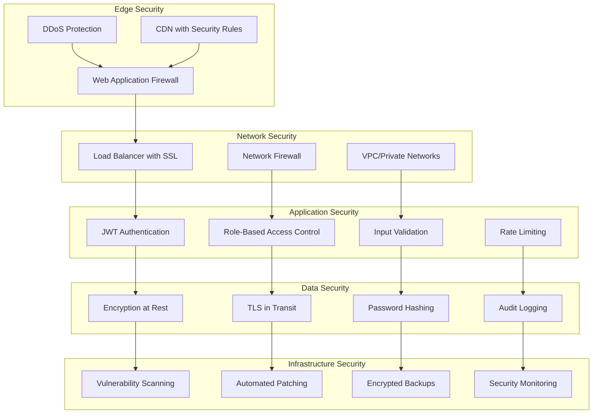

# System Architecture

This document describes the architecture of the Portfolio Optimization Dashboard using the C4 model approach, providing different levels of detail for various audiences.

## Table of Contents

1. [System Context (Level 1)](#system-context-level-1)
2. [Container Diagram (Level 2)](#container-diagram-level-2)
3. [Component Diagram (Level 3)](#component-diagram-level-3)
4. [Code Diagram (Level 4)](#code-diagram-level-4)
5. [Architecture Decisions](#architecture-decisions)
6. [Quality Attributes](#quality-attributes)
7. [Deployment Architecture](#deployment-architecture)
8. [Security Architecture](#security-architecture)

## System Context (Level 1)

The Portfolio Optimization Dashboard is a web-based financial platform that helps users optimize their investment portfolios using modern portfolio theory.



### Key External Dependencies

- **Market Data APIs**: Yahoo Finance, Alpha Vantage, IEX Cloud for real-time and historical data
- **Authentication Services**: Auth0, AWS Cognito, or Google OAuth for user management
- **Notification Services**: SendGrid, AWS SES for email notifications
- **Cloud Storage**: AWS S3, Google Cloud Storage for file storage
- **Monitoring**: DataDog, New Relic for application performance monitoring

## Container Diagram (Level 2)



### Container Responsibilities

| Container | Technology | Responsibility |
|-----------|------------|----------------|
| **Single-Page Application** | React 18, TypeScript, Vite | User interface, client-side state management, data visualization |
| **API Application** | FastAPI, Python 3.11 | Business logic, authentication, data validation, API endpoints |
| **Background Workers** | Celery, Python | Intensive calculations, batch processing, scheduled tasks |
| **WebSocket Server** | FastAPI WebSocket | Real-time updates, live notifications, collaborative features |
| **Primary Database** | PostgreSQL 15 | User data, portfolios, optimization results, audit logs |
| **Cache & Queue** | Redis 7 | Session storage, API caching, job queue management |
| **Time Series Database** | InfluxDB | Historical prices, performance metrics, monitoring data |

## Component Diagram (Level 3)

### API Application Components



### Frontend Application Components



## Architecture Decisions

### Key Architectural Patterns

1. **Microservices-Ready Monolith**
   - Single deployable unit that can be split into microservices
   - Clear service boundaries with dependency injection
   - Shared database with potential for database-per-service migration

2. **Event-Driven Architecture**
   - Redis pub/sub for real-time updates
   - Background job processing with Celery
   - WebSocket connections for live notifications

3. **CQRS (Command Query Responsibility Segregation)**
   - Separate read and write models for complex analytics
   - Optimized read models for dashboard performance
   - Event sourcing for audit trails

4. **Layered Architecture**
   - Presentation Layer (React SPA)
   - API Layer (FastAPI)
   - Business Logic Layer (Services)
   - Data Access Layer (Repositories)

### Technology Choices

| Aspect | Technology | Rationale |
|--------|------------|-----------|
| **Frontend Framework** | React 18 | Large ecosystem, TypeScript support, mature tooling |
| **Backend Framework** | FastAPI | High performance, automatic API docs, async support |
| **Database** | PostgreSQL | ACID compliance, JSON support, excellent performance |
| **Cache** | Redis | High performance, pub/sub, job queue capabilities |
| **Authentication** | JWT + OAuth | Stateless, scalable, industry standard |
| **Optimization** | NumPy/SciPy | Battle-tested numerical libraries, excellent performance |
| **Monitoring** | Prometheus + Grafana | Open source, powerful querying, great visualization |

### Design Principles

1. **Security by Design**
   - Defense in depth approach
   - Encryption at rest and in transit
   - Comprehensive input validation
   - Regular security audits

2. **Performance First**
   - Sub-second API response times
   - Aggressive caching strategies
   - Web Workers for heavy computations
   - Database query optimization

3. **Scalability**
   - Horizontal scaling capability
   - Stateless application design
   - Efficient resource utilization
   - Auto-scaling support

4. **Maintainability**
   - Clean code principles
   - Comprehensive testing
   - Automated deployment
   - Clear documentation

## Quality Attributes

### Performance Requirements

| Metric | Target | Measurement |
|--------|--------|-------------|
| **API Response Time** | < 200ms (P95) | Application Performance Monitoring |
| **Page Load Time** | < 2s (First Contentful Paint) | Lighthouse CI |
| **Optimization Time** | < 5s (50 assets) | Custom metrics |
| **Concurrent Users** | 1000+ | Load testing |
| **Database Query Time** | < 50ms (P95) | Query performance monitoring |
| **Memory Usage** | < 512MB per container | Container monitoring |

### Availability Requirements

- **Uptime**: 99.9% (8.77 hours downtime per year)
- **Recovery Time Objective (RTO)**: < 1 hour
- **Recovery Point Objective (RPO)**: < 15 minutes
- **Health Checks**: Every 30 seconds
- **Circuit Breakers**: For external API calls
- **Graceful Degradation**: Core features available during partial outages

### Security Requirements

- **Authentication**: Multi-factor authentication support
- **Authorization**: Role-based access control (RBAC)
- **Data Encryption**: AES-256 for sensitive data
- **Transport Security**: TLS 1.3 minimum
- **Input Validation**: Comprehensive sanitization
- **Audit Logging**: All user actions logged
- **Vulnerability Scanning**: Automated security testing
- **Compliance**: SOC 2 Type II, GDPR compliant

## Deployment Architecture

### Production Environment

```mermaid
graph TB
    subgraph "Load Balancer"
        LB[ALB/CloudFlare]
    end
    
    subgraph "CDN"
        CDN[CloudFlare CDN]
    end
    
    subgraph "Kubernetes Cluster"
        subgraph "Frontend Pods"
            FE1[React App 1]
            FE2[React App 2]
            FE3[React App 3]
        end
        
        subgraph "API Pods"
            API1[FastAPI 1]
            API2[FastAPI 2]
            API3[FastAPI 3]
        end
        
        subgraph "Worker Pods"
            W1[Celery Worker 1]
            W2[Celery Worker 2]
        end
    end
    
    subgraph "Databases"
        PG[(PostgreSQL Primary)]
        PGR[(PostgreSQL Replica)]
        RD[(Redis Cluster)]
        IF[(InfluxDB)]
    end
    
    subgraph "External Services"
        S3[AWS S3]
        MARKET[Market Data APIs]
        AUTH[Auth Provider]
    end
    
    CDN --> FE1
    CDN --> FE2
    CDN --> FE3
    
    LB --> API1
    LB --> API2
    LB --> API3
    
    API1 --> PG
    API2 --> PG
    API3 --> PGR
    
    API1 --> RD
    API2 --> RD
    API3 --> RD
    
    W1 --> PG
    W2 --> PG
    W1 --> RD
    W2 --> RD
    
    API1 --> S3
    W1 --> MARKET
    API1 --> AUTH
```

### Container Orchestration

- **Platform**: Kubernetes 1.28+
- **Ingress**: NGINX Ingress Controller
- **Service Mesh**: Istio (optional)
- **Secrets Management**: Kubernetes Secrets + External Secrets Operator
- **Auto Scaling**: Horizontal Pod Autoscaler (HPA)
- **Monitoring**: Prometheus + Grafana
- **Logging**: ELK Stack (Elasticsearch, Logstash, Kibana)

### Environment Strategy

| Environment | Purpose | Configuration |
|-------------|---------|---------------|
| **Development** | Local development | Docker Compose, minimal resources |
| **Staging** | Pre-production testing | Kubernetes, production-like setup |
| **Production** | Live system | Kubernetes, high availability, monitoring |
| **DR** | Disaster recovery | Cross-region deployment, automated failover |

## Security Architecture

### Defense in Depth



### Security Controls

1. **Preventive Controls**
   - Input validation and sanitization
   - Authentication and authorization
   - Network segmentation
   - Encryption of sensitive data

2. **Detective Controls**
   - Security monitoring and alerting
   - Audit logging and analysis
   - Vulnerability scanning
   - Intrusion detection

3. **Corrective Controls**
   - Incident response procedures
   - Automated patching
   - Backup and recovery
   - Security training

### Compliance Framework

- **Data Privacy**: GDPR, CCPA compliance
- **Financial Regulations**: SOX compliance for financial data
- **Security Standards**: ISO 27001, SOC 2 Type II
- **Industry Standards**: NIST Cybersecurity Framework
- **Code Security**: OWASP Top 10 mitigation

---

*This architecture documentation is maintained by the development team and updated with each major release. For questions or clarifications, please refer to the [contributing guidelines](../../CONTRIBUTING.md) or contact the architecture team.*