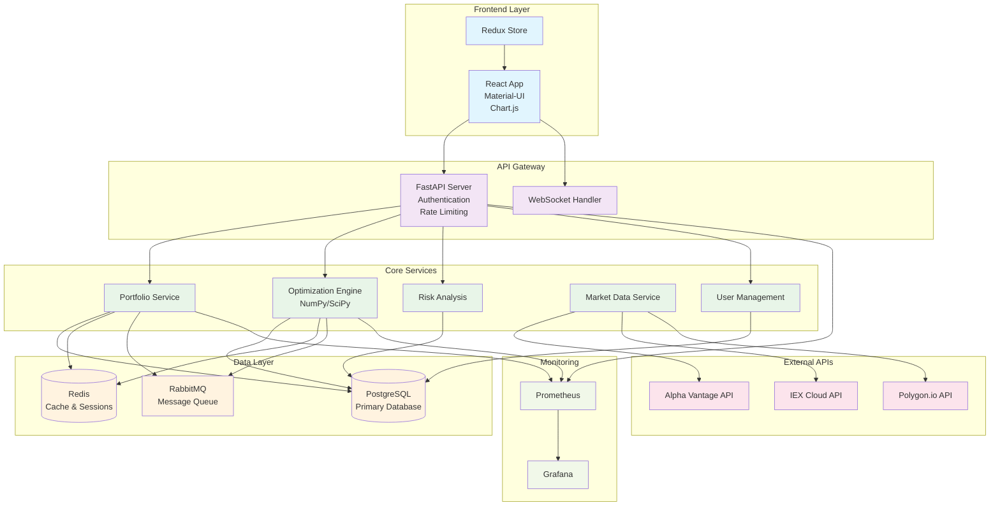

# Architecture Diagram Specification

This document specifies the requirements for the Portfolio Optimization Dashboard architecture diagram referenced in the README.

## Diagram Requirements

### Visual Style
- **Format**: PNG (1000x700px minimum)
- **Style**: Professional, clean, modern
- **Colors**: Blue (#2563eb), Green (#059669), Gray (#6b7280) palette
- **Typography**: Sans-serif, readable at small sizes

### Components to Include

#### Frontend Layer
- **React App** (Browser)
- **Material-UI Components**
- **Chart.js Visualizations**
- **Redux State Management**

#### API Gateway Layer
- **FastAPI Server**
- **Authentication Middleware**
- **Rate Limiting**
- **WebSocket Handler**

#### Core Services
- **Portfolio Management Service**
- **Optimization Engine** (NumPy/SciPy)
- **Risk Analysis Service**
- **Market Data Service**
- **User Management Service**

#### Data Layer
- **PostgreSQL Database** (Primary storage)
- **Redis Cache** (Session & caching)
- **Message Queue** (RabbitMQ/Celery)

#### External Services
- **Market Data APIs** (Alpha Vantage, IEX, Polygon)
- **Email Service** (SendGrid)
- **Monitoring** (Prometheus/Grafana)

#### Infrastructure
- **Docker Containers**
- **Kubernetes Pods** (optional)
- **Load Balancer**
- **CDN** (Static assets)

### Data Flow Arrows

Show the following connections:
1. User → Frontend → API Gateway
2. API Gateway → Core Services
3. Core Services → Database/Cache
4. Market Data APIs → Market Data Service
5. Optimization Engine → Portfolio Service
6. Monitoring ← All Services

### Labels and Annotations

- Technology stack badges for each component
- Protocols used (HTTP/HTTPS, WebSocket, TCP)
- Data flow directions
- Component responsibilities

## Implementation Tools

Recommended tools for creating the diagram:
- **Lucidchart** (Professional diagrams)
- **Draw.io** (Free, web-based)
- **Figma** (Design-focused)
- **Adobe Illustrator** (High-quality output)

## Example Mermaid Code

For reference, here's a simplified version in Mermaid syntax:

## File Naming

Save the final diagram as:
- `docs/assets/architecture-diagram.png` (Primary)
- `docs/assets/architecture-diagram.svg` (Vector version)
- `docs/assets/architecture-diagram-simple.png` (Simplified version)

## Usage Context

This diagram will be used in:
- README.md main architecture section
- Wiki Architecture documentation
- Presentation materials
- Developer onboarding
- System documentation

The diagram should be self-explanatory and help developers understand the system at a glance.